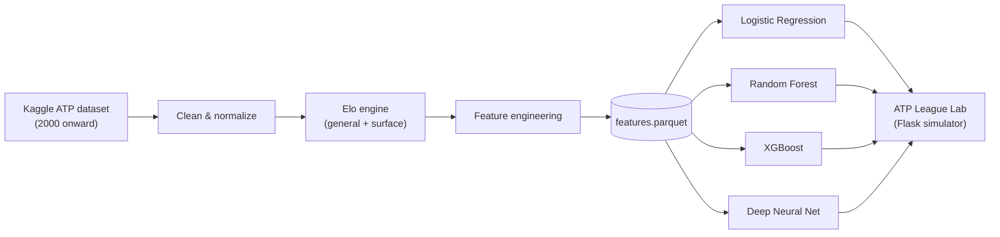

# Tennis Prediction

> **Documentation status:** Documented by Sonnet-5.

> Predicting ATP match outcomes from two decades of professional tennis — with four different models built around one non-negotiable design rule: **the prediction must not depend on which player happens to be listed first.**

## Video

My YouTube video for this project:

**YouTube:** [Watch the project video](link.link)

## Table of Contents

- [Overview](#overview)
- [Highlights](#highlights)
- [Dataset](#dataset)
- [Methodology](#methodology)
  - [Pre-processing Pipeline](#pre-processing-pipeline)
  - [Elo Rating Engine](#elo-rating-engine)
  - [Feature Set](#feature-set)
  - [Symmetry by Design](#symmetry-by-design)
- [Models & Results](#models--results)
- [ATP League Lab — Interactive Simulator](#atp-league-lab--interactive-simulator)
- [Project Structure](#project-structure)
- [Getting Started](#getting-started)
- [Possible Extensions](#possible-extensions)
- [License](#license)

## Overview

This project builds a full pipeline for predicting the winner of an ATP singles match — from raw match records to a trained, servable model:



Raw match data is cleaned, used to compute chronological Elo ratings (both overall and per-surface), turned into a compact feature set, and then fed to four independently trained models — a logistic regression, a random forest, an XGBoost classifier, and a small neural network — so their approaches to the same problem can be compared directly. A Flask + vanilla-JS web app then lets you simulate a miniature ATP tournament match-by-match using any of the trained models as the estimator.

## Highlights

- **Chronological, leakage-free evaluation.** Every train/test split and every Elo update respects match order — a player's rating at match *N* only ever reflects matches *1..N-1*.
- **A proper Elo engine, not a lookup table.** Includes both a general Elo and a surface-aware Elo with experience-based blending across similar surfaces (see [Elo Rating Engine](#elo-rating-engine)).
- **Four models, one shared contract.** Logistic Regression, Random Forest, XGBoost, and a DNN are all trained on (variants of) the same feature set and are all constrained to be *symmetric* — see [Symmetry by Design](#symmetry-by-design).
- **Train/serve consistency.** The Flask simulator reconstructs the exact same feature vector at request time that the models saw during training, using precomputed player stats — no separate "inference-only" feature logic to drift out of sync.
- **A playable result.** Beyond notebooks and metrics, the project ships an interactive bracket simulator ("ATP League Lab") to actually watch a model's predictions play out over a tournament.

## Dataset

Match data comes from the [`dissfya/atp-tennis-2000-2023daily-pull`](https://www.kaggle.com/datasets/dissfya/atp-tennis-2000-2023daily-pull) dataset on Kaggle (fetched automatically via [`kagglehub`](https://github.com/Kaggle/kagglehub) — it's a continuously-updated "daily pull" dataset, so exact row counts and date coverage grow over time).

At the snapshot used for this project:

| | |
|---|---|
| Raw matches | 68,408 rows × 18 columns |
| Usable after cleaning | 68,382 (26 rows dropped for missing rank data) |
| Surfaces | Hard 53.9% · Clay 32.4% · Grass 11.3% · Carpet 2.4% |
| Match format | Best-of-3: 81.1% · Best-of-5: 18.9% |
| Tournaments | 268 unique events |
| Coverage | ATP singles matches from 2000 onward |

Each row is one completed match: the two players, their ATP rank and ranking points at the time, the surface, the round, the format (best of 3/5), and the winner.

## Methodology

### Pre-processing Pipeline

`src/pre_process/pipeline.py` runs the full sequence end-to-end (also walked through interactively in `notebooks/exploration.ipynb`):

1. **Clean** — sort matches chronologically, drop metadata columns not useful for prediction (tournament name, date, round, betting odds, score), coerce invalid rank/points entries to `NaN`, and drop rows with unusable rank data.
2. **Normalize names** — strip accents/diacritics and collapse stray whitespace in player names (e.g. `Čilić` → `Cilic`) so the same player is never split into two identities.
3. **Elo** — compute both a general and a surface-specific Elo rating for every player, snapshotted immediately *before* each match.
4. **Feature engineering** — transform points/rank into scale-invariant `log1p` differences, one-hot encode surface, and binarize best-of-5.
5. **Export** — write the final training table to `src/data/pre_processed/features.parquet`, plus a separate `elo_baseline.parquet` holding the closed-form Elo win probability for use as a sanity-check baseline.

### Elo Rating Engine

`src/pre_process/elo.py` implements two related but distinct rating systems:

- **General Elo** — a standard Elo rating (base 1500) with an experience-adaptive K-factor, `K(n) = 250 / (n + 5)^0.4`, so new players' ratings move quickly while established players' ratings stabilize.
- **Surface Elo** (`SurfaceEloCalculator`) — separate ratings per surface (Hard/Clay/Grass/Carpet) plus an overall rating. For a player with little history on a given surface, the effective rating blends the surface rating with ratings from similar surfaces (Hard↔Carpet, Grass↔Carpet) and the overall rating, linearly ramping to full trust in the surface-specific number once a player has logged enough matches on it.

Both engines process matches strictly in date order and only ever expose *pre-match* state, which is what keeps the whole pipeline leakage-free.

### Feature Set

The final table used by Random Forest, XGBoost, and the DNN has 13 features (Logistic Regression extends this with a few hand-built interaction terms):

| Feature | Meaning |
|---|---|
| `Elo_diff`, `Elo_mean` | Difference and average of general Elo between the two players |
| `N_min` | Minimum career match count between the two players (experience floor) |
| `elo_surface_diff` | Difference in raw surface-specific Elo |
| `elo_effective_diff` | Difference in blended (experience-weighted) surface Elo |
| `spec_diff` | Difference in "surface specialization" — how much better each player is on this surface vs. their overall level |
| `surface_exp_min` | Minimum matches either player has played on this surface |
| `log_pts_diff`, `log_rank_diff` | `log1p` differences in ATP ranking points and rank |
| `Surface_Clay`, `Surface_Grass`, `Surface_Hard` | One-hot encoded surface (Carpet is folded into Grass — it's too rare, ~2% of matches, to model separately) |
| `Best_of_5` | Whether the match is best-of-5 sets (Grand Slams, Davis Cup) |

### Symmetry by Design

A tennis match has no meaningful "Player 1" — the label is just an artifact of how the row was written down. Every model in this repo is therefore built to satisfy `P(win | swap players) = 1 - P(win | original order)` exactly, enforced a different way per model:

- **Logistic Regression / DNN** — the input features are constructed to be *odd* (they flip sign when the two players swap), and both models are built with **no intercept/bias term** (`fit_intercept=False`, `use_bias=False`). An odd function of odd inputs stays odd, so the symmetry falls out of the architecture itself rather than needing to be corrected after the fact. The DNN reinforces this by using `tanh` (an odd activation) in every hidden layer.
- **Random Forest / XGBoost** — trees can't be constrained this way architecturally, so symmetry is instead enforced by **data augmentation**: every training row `(x, y)` is mirrored into an extra row `(-x, 1-y)`, and at inference time the prediction is the average of `p(x)` and `1 - p(-x)`. The custom `SymmetricForest` estimator (`src/random_forest/model.py`) wraps `RandomForestClassifier` to do this automatically inside `fit()`, so cross-validation never leaks a mirrored row across a train/validation split.

## Models & Results

All models share the same chronological 80/20 train/test split (no shuffling — this is time-series data) and are evaluated on accuracy, ROC-AUC, log-loss, and Brier score.

| Model | Notebook | Test Accuracy | Test AUC | Log-Loss | Brier |
|---|---|---|---|---|---|
| Elo-only baseline (1 feature) | [`simple_estimate.ipynb`](notebooks/simple_estimate.ipynb) | 64.3% | 0.706 | 0.624 | 0.218 |
| Logistic Regression | [`logistic_regression.ipynb`](notebooks/logistic_regression.ipynb) | 65.0% | 0.715 | 0.616 | 0.215 |
| Random Forest (symmetric) | [`Random_Forest.ipynb`](notebooks/Random_Forest.ipynb) | 65.1% | 0.717 | 0.615 | 0.214 |
| XGBoost (symmetric) | [`XGBoost.ipynb`](notebooks/XGBoost.ipynb) | 65.1% | 0.717 | 0.614 | 0.214 |
| Deep Neural Network | [`dnn.ipynb`](notebooks/dnn.ipynb) | 65.0% | 0.712 | 0.619 | 0.216 |

A couple of things stand out:

- All four full-featured models land within a fraction of a percentage point of each other, despite having very different capacities — a linear model, two flavors of tree ensemble, and a neural net. That tight clustering suggests the feature set (Elo, rank/points, surface, experience) captures most of what's predictable pre-match, and the remaining error is closer to the sport's genuine day-to-day variance than to any one model under-fitting.
- Every model comfortably beats the single-feature Elo-only baseline, confirming that rank/points, surface specialization, and experience each add real signal beyond Elo alone — just not enough to push far past the ~65%/0.72 AUC region.
- Each notebook's evaluation also includes a reliability (calibration) curve, not just point metrics — worth checking if you're using predicted probabilities directly rather than just the predicted class.

## ATP League Lab — Interactive Simulator

`src/visualization/` is a small Flask + vanilla-JS app that turns the trained models into something you can actually watch play out:

- Pick a tournament size (6/8/10/12 players) drawn from a pool of real ATP players with precomputed career stats, and pick which of the four trained models acts as the estimator.
- Step through the bracket one match at a time, or simulate straight through to a champion. Each match's outcome is drawn stochastically from the model's predicted win probability (not just "higher probability always wins"), on hard courts, best-of-3, by default.
- Watch a live bracket map, a standings table, a win-probability bar for the upcoming match, and a running results feed update as the tournament progresses.

Under the hood, `POST /api/estimate` (`src/visualization/server.py` → `estimator.py` → `models.py`) loads the requested pickled model (and its scaler, where one is needed) and rebuilds the same 13-value feature vector the model was trained on from the two players' precomputed stats — so live predictions stay consistent with training.

## Project Structure

```
Tennis-Prediction/
├── notebooks/
│   ├── exploration.ipynb        # EDA + interactive walkthrough of the pipeline
│   ├── simple_estimate.ipynb    # Elo-only baseline
│   ├── logistic_regression.ipynb
│   ├── Random_Forest.ipynb
│   ├── XGBoost.ipynb
│   └── dnn.ipynb
├── src/
│   ├── data/
│   │   └── download.py          # Kaggle dataset fetcher (via kagglehub)
│   ├── pre_process/
│   │   ├── clean.py             # Cleaning & missing-value handling
│   │   ├── name_fix.py          # Player name normalization
│   │   ├── elo.py               # General + surface Elo rating engine
│   │   ├── feature.py           # Feature engineering & encoding
│   │   └── pipeline.py          # End-to-end pre-processing pipeline
│   ├── logistic_regression/
│   │   └── pre_process_tools.py # LR-specific features, scaling, split
│   ├── random_forest/
│   │   ├── model.py             # SymmetricForest estimator
│   │   └── tools.py
│   ├── xgb/
│   │   └── model.py             # Symmetric XGBoost train/predict helpers
│   └── visualization/           # "ATP League Lab" simulator
│       ├── server.py            # Flask app & /api/estimate endpoint
│       ├── estimator.py         # Feature reconstruction for live requests
│       ├── models.py            # Loads pickled models/scalers, dispatches predictions
│       └── index.html / app.js / styles.css / model-adapter.js / players.js
├── requirements.txt
├── LICENSE
└── README.md
```

## Getting Started

### Prerequisites

- Python 3.10+
- A Kaggle account is not strictly required, but if `kagglehub` prompts for authentication on first download, see [kagglehub's auth docs](https://github.com/Kaggle/kagglehub#authenticate).

### Installation

```bash
git clone https://github.com/nily-warehouse/Tennis-Prediction.git
cd Tennis-Prediction
pip install -r requirements.txt
pip install pyarrow   # used for Parquet I/O in the pipeline; not currently pinned in requirements.txt
```

### 1. Build the dataset

```bash
python src/pre_process/pipeline.py
```

This downloads the raw dataset, cleans it, computes Elo ratings, engineers features, and writes `src/data/pre_processed/features.parquet` and `elo_baseline.parquet`. (`notebooks/exploration.ipynb` walks through the same steps interactively, with plots.)

### 2. Train the models

The training notebooks pickle their output to `src/data/trained_models/` (and `src/data/scaler/` where a scaler is needed) — create those folders first, since they're git-ignored and won't exist on a fresh clone:

```bash
mkdir -p src/data/trained_models src/data/scaler
```

Then run each notebook (any order — each only needs `features.parquet` to exist):

| Notebook | Produces |
|---|---|
| `notebooks/logistic_regression.ipynb` | `logistic_model.pkl`, `logistic_reg_scaler.pkl` |
| `notebooks/Random_Forest.ipynb` | `rf_model.pkl` |
| `notebooks/XGBoost.ipynb` | `xgb_model.pkl` |
| `notebooks/dnn.ipynb` | `dnn_model.pkl`, `dnn_scaler.pkl` |

### 3. Launch the simulator

```bash
cd src/visualization
python server.py
```

Open **http://127.0.0.1:5000**, pick a tournament size and a model, and play through a simulated bracket.

## Possible Extensions

A few natural directions if you want to push past the current ~65% / 0.72 AUC plateau:

- Ensembling the four models (they're diverse enough in architecture that even simple averaging might help).
- Adding recent-form features (e.g. rolling win rate over the last *N* matches) rather than relying on Elo/rank alone.
- Head-to-head history between the specific two players as an additional feature.
- Letting the simulator vary surface and best-of format per round instead of hard-coding hard-court, best-of-3.

## License

Released under the [MIT License](LICENSE) — © 2026 Nily Warehouse.